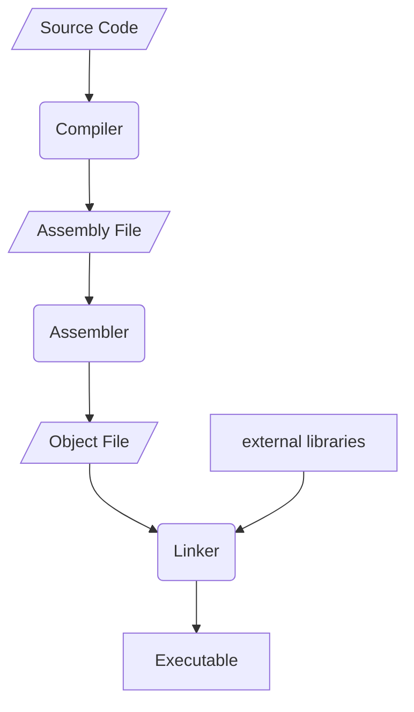

---
tags:
  - personal-project/programming
  - personal-project/compiler
---
Compilers seem like these black magic thingies that take code and make executables, but its actually just an app on your computer that you can make.

# Compiler steps
The compiler takes some steps from source code to an executable file.
The following flowchart may seem like a lot of steps but most of these are done fairly simply.

## Source code to assembly file
The compiler step basically means translating your text into assembly instructions. Kind of like translating English to French but if French was readable by a computer.
This is the part that ill be making.

## Assembly file to object file
The next step is assembling the assembly file into an object file.
An object file is basically just a machine code file. It is not an executable yet because it needs to be linked with the right external libraries. 
This step is done really easily because machine code is almost one to one with machine code, its just readable for humans. 

## Object file to executable
The object file will now be put trough a linker to link it with the right external libraries. Some libraries like the windows window API are external libraries, and you need to link it in order for the executable to target the right one.

After this you will have your executable which you can run

All these steps seem like itd be a lot, but the assembling and linking will be done quite easily. The real challenge comes from compiling the code.

>[!abstract] next article
> [[Personal-projects/Making my own compiler/02 - Setting up the project|For the next step well set up the project]]

