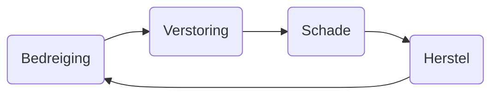

---
tags:
  - school/cyber-security
  - language/dutch
  - taal/nederlands
banner:
publish: "true"
---

>[!important] Opdracht: Wetgeving en Normen
>Doel: Je bekend en vertrouwd maken met wet- en regelgevingen en normen die belangrijk zijn voor cybersecurity. Door dit onderzoek zul je begrijpen aan welke richtlijnen en vereisten organisaties moeten voldoen om een effectieve cybersecuritystrategie te ontwikkelen en implementeren.
>1. Onderzoek wetten en regels rond cybercrimaneliteit , zowel nationaal en internationaal.
>	- Ieder groepslid kiest één norm of wet
>2. Focus je op wetten zoals NIST Cybersecurity Framework, AVG, NIS2, maar ook de wet Computercriminaliteit III
>3. Gebruik verschillende bronnen zoals overheidsinstellingen, officiële publicaties, 
>4. Beantwoord de volgende vragen als leidraad voor je onderzoek:
>	1. Welke nationale en internationale wetten zijn er?
>	2. wat zijn de belangrijkste vereisten van deze wetten?
>	3. welke normen worden vaak gebruikt als referentie? Op welke sectoren zijn ze van toepassing?
>	4. Hoe worden deze normen toegepast in de praktijk binnen organisaties?
>	5. Wat zijn de voordelen voor organisaties om deze wetten en regels te volgen?
>	6. Wat zijn de recentelijke ontwikkelingen of updates in wet- en regelgevingen?
>5. Verwerk de resultaten in een matrix waar de verschillende wetten, regelgevingen en normen worden vermeld met hun belangrijkste vereisten en toepassingsgebieden (sectoren, soort organisaties)
# Intro
Traditioneel inbreken in iemands huis vereist dat je naar dat huis toe moet. Met cybercrime hoef je niet eens je huis uit. Hacken, phishen, internet extortion, internet fraud, identity theft, child exploitation, alles kan vanuit je slaapkamer gedaan worden.

ICT maakt deze acties al een stuk makkelijker, maar gelukkig zijn er regels en wetgevingen die dit strafbaar maken. Tegenwoordig however, zijn er ook nieuwe misdaden, new crimes, waarvoor nog niet goede wetten en kaders voor gemaakt zijn.

# Risico’s
> **Risico**: iets wat je niet wilt dat het gebeurt, maar de kans is er wel

In relatie tot cybersecurity, is een risico een kans dat een mogelijk gevaar resulteert in een daadwerkelijk incident en wat de consequenties hiervan zijn voor de operaties van een organisatie. Hoe groter het risico, hoe meer je eraan werkt om het te voorkomen. Neem bijvoorbeeld een brand melder, die waarschuwt je als een brand start zodat je er tijdig iets aan kan doen: een **repressie maatregel**. Eigenlijk moet een brand niet eens starten, je wilt het voorkomen: een **preventie maatregel**.

Een risico in formule vorm: `Risico = Bloodstelling * Kans * Gevolg` / `R = B * W * E`. 
- **Blootstelling** (B): Wanneer en waar het gevaar zich voordoet
- **Kans** (waarschijnlijkheid, W): De waarschijnlijkheid dat de gevolgen optreden naar aanleiding van de blootstelling
- **Gevolg** (effect, E): Het effect of de consequentie van het optreden van een incident

Dit geeft geen concreet getal met 3 cijfers achter de komma, maar het werkt wel perfect om met elkaar te bespreken. Bespreek dit ook *samen*!! Niet alleen op je kamer met boeken en chatgpt. 2 weten meer dan 1 en 4 weten meer dan 2, immers. Verschillende mensen hebben andere ervaringen en kijken door hun scholing anders naar een risico. Misschien is een persoon meer afwachtend en de andere meer zoekend. De ervaring en aard van personen kun je niet zomaar terug vinden op het internet (misschien wel wat, maar niet zoveel als face to face).

## Risico’s Prioriteren
Je kan niet alle risico’s tegelijkertijd aanpakken, je moet er een ranking van maken (met gebruik van de risico formule) en het in een Risk Matrix stoppen. Een risk matrix is als het ware een heat map met alle risico’s en welke het meeste impact hebben

![[Vault-data/Attachments/Risicodenken en -management risk matrix.png]]

# Risicobenadering en Scenariobenadering
>**Risicobenadering**: Zet de risico’s in volgorde van groot naar klein. De risico’s die groot zijn, verklein je met het nemen van maatregelen tot een acceptabel niveau. Zo richt je inspanningen op risico’s waar de meeste veiligheidswinst te behalen valt.

>**Scenariobenadering**: Je gaat er vanuit dat het misgaat. Je maakt een scenario over het incident. Zo zorg je dat je voorbereid bent als het mis gaat. Je treft bij scenariobenadering vooral de preparatie- en repressiemaatregelen. De scenariobenadering gaat uit van de gevolgen van een risico.

Scenariobenadering is veel belangrijker voor cybersecurity, omdat het tegenwoordig geen vraag is of een aanval gebeurt, maar wanneer.

## Risicobenadering (managementstrategieën)
> **ATMAS**: Avoid, Transfer, Mitigate, Accept, Share

- **Avoid**: Elimineer de risico door de activiteit of situatie die het kan oorzaken, te vermeiden.
	- Doe de activiteit niet
- **Transfer** (share): Verplaats de risico door het naar een andere groep te verleggen, zoals een verzekering of outsourcing.
	- Sluit een verzekering af of laat iemand anders het doen
- **Mitigate**: Implementeer controle of acties die de kans of impact van het risico verkleinen.
	- Open vuur verbod, rookmelders, sprinklers, 2-factor authenticatie, encryptie, backups etc.
- **Accept**: Accepteer en erken de risico en diens consequenties en bereid je voor op de impact.
	- Accepteer dat het kan gebeuren en neem maatregelen, maak plannen, etc
- **(Share)**: Verdeel de taak en risico tussen meerdere partijen.
	- Verzeker een deel, verdeel de verantwoordelijkheid over personen

### Betrouwbaarheid van informatievoorziening
In de cybersecurityspace is hier een term voor gemaakt
> **BIV**: Beschikaarheid, Integriteit, Vertrouwelijkheid
Of in het Engels…
>**CIA**: Confidentiality, Integrity, Availability

**Beschikbaarheid** betekent dat een service operationeel of benaderbaar moet zijn. Als een database eruit ligt, kan je de data niet gebruiken. Een DDoS aanval (Distributed Denial of Service, een website overspoelen met requests) word vaak gebruikt om de beschikbaarheid van een website of applicatie neer te halen.

Klopt de data die je ziet? Heeft een service **integriteit**? Als je een toets maakt en je gegevens worden op de online omgeving gezet, ga je ervan uit dat de dat die daar staat ook klopt.

De kaders en veiligheid van de gepresenteerde data moet een niveau aan **vertrouwelijkheid** hebben. Als ik inlog op mijn bankrekening, wil ik niet de gegevens van mijn buurman krijgen. Neem maatregelen dat gegevens niet gestolen kunnen worden, privacy moet hier goed gewaarborgd worden.

Dus als een recap, services moeten beschikbaar zijn wanneer nodig, de informatie moet kloppen en niet vervalsbaar zijn en de data die je ziet moet vertrouwelijk zijn: alleen jij moet jou data kunnen zien.

>[!important]
> In een bedrijf moet je altijd bewust zijn van “*wie is er eigenaar van het risico*?”. Als niemand eigenaar is van het risico, is het geen risico.

# De incidentcyclus

- **Bedreiging**: Iets dat zou kunnen gebeuren (hackers, stroomstoring)
- **Verstoring**: Als de bedreiging leid tot incident
	- Zorg dat je erachter komt dat er iets aan de hand is - Detectie!!
- **Schade**: Door een incident kan schade ontstaan aan informatie of middelen
- **Herstel**: Het herstellen van de ontstane schade

## Maatregelen
![[Vault-data/Attachments/Risicodenken en -management.png]]
- Preventief: Voorkomen dat bedreigingen tot een verstoring leiden
- Detectief Een incident zo snel mogelijk ontdekken. Ondersteunend voor preventie en repressie
- Repressief: De negatieve invloed van een verstoring minimaliseren
- Correctief: Herstellen van objecten die bij een incident beschadigt zijn

Soort maatregelen kan je onderverdelen in 3 typen. Daarnaast kan het 4 plekken hebben in de beveiligingscyclus: Preventief, defectief, repressief of correctief.
### Organisatorische maatregelen
Organisatorische maatregelen zijn maatregelen die betrekking hebben op een organisatie, de mens of procedures. Denk hierbij aan wet- of regelgevingen.

### Logische maatregelen
Logische maatregelen zijn alle maatregelen die zijn opgenomen in de programmatuur van applicaties of software. Dit kunnen dus dingen zijn zoals sensoren, monitoring of de techniek van een systeem.
### Fysieke maatregelen
Fysieke maatregelen zijn, zoals de naam zegt, maatregelen die gemaakt zijn door apparatuur of iets anders wat je fysiek tegen houd. Sloten, sprinklers of hekken vallen hier onder.

### Voorbeelden van maatregelen
![[Vault-data/Attachments/Risicodenken en -management voorbeelden.png]]

# Dreiging, Gevaar
Een dreiging is een proces of gebeurtenis die in potentie een verstorende invloed heeft op een **object** van de informatievoorziening:
- Apparatuur
- Programmatuur
- Gegevens
- Procedures
- Mensen

De dreiging kan zowel van buiten (hacker) als van binnen (frauderende medewerker) komen. Als de dreiging werkelijkheid word, dan resulteert dat in schade aan belangen:
- Assets / Waardevolle eigendommen
- Het openbaren van informatie en/of verstoring van waardevolle processen

Een dreiging wordt pas relevant als sprake is van een **kwetsbaarheid** voor een belang (asset) en een kwaadwillende die een **intentie** heeft om het belang aan te vallen.

Maar! het is niet altijd de resultaten van kwaadwillige acties.

![[Vault-data/Attachments/Risicodenken en -management dam foto.png]]
Dit is ook een dreiging. Andere dingen kunnen zijn:
- Kabelbreuk
- Brand
- Softwarefout
- Stroomstoring

# Sources
- https://www.ncsc.nl/wet-en-regelgeving/wet-beveiliging-netwerk-en-informatiesystemen-wbni
- https://www.open-overheid.nl/documenten/2023/01/06/algemene-verordening-gegevensbescherming
- https://www.nctv.nl/onderwerpen/c/cyberbeveiligingswet
- https://www.digitaleoverheid.nl/overzicht-van-alle-onderwerpen/cyberbeveiligingswet/
- https://www.forumstandaardisatie.nl/open-standaarden/nen-isoiec-27001
- https://www.digitaleoverheid.nl/overzicht-van-alle-onderwerpen/cyberbeveiligingswet/